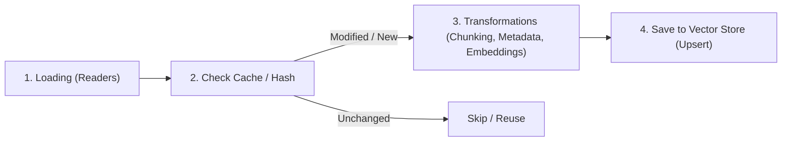
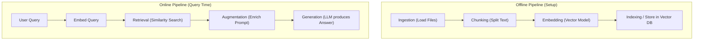
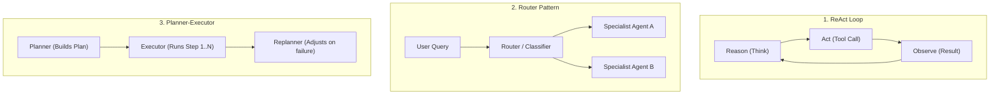
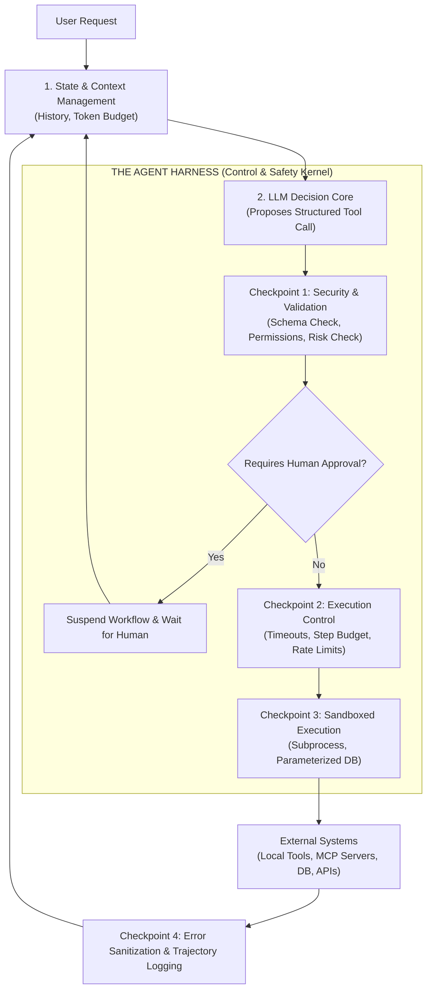

# Comprehensive Exam Review Guide: Local AI & LLM Systems
**Course:** ITE / AX Specialize Program — Mastering Local LLM  
**Institution:** KSGA — Korea Software HRD Center (KSHRD)  
**Target Coverage:** Monthly Exam Review (Based on Teacher Highlights & Course Slide Decks)

---

## Table of Contents
1. [Part 1: 04. Workflow Engineering with LLM Frameworks](#part-1-04-workflow-engineering-with-llm-frameworks)
   - [1.1 Introduction to LLM Workflow](#11-introduction-to-llm-workflow)
   - [1.2 Chaining & Execution Patterns](#12-chaining--execution-patterns)
   - [1.3 Managing State, Memory, and Persistence](#13-managing-state-memory-and-persistence)
   - [1.4 Document Ingestion Pipelines](#14-document-ingestion-pipelines)
   - [1.5 Modular Workflow Design](#15-modular-workflow-design)
   - [1.6 Orchestration Frameworks: LlamaIndex, LangChain, LangGraph](#16-orchestration-frameworks-llamaindex-langchain-langgraph)
2. [Part 2: Module 1 — RAG Fundamentals](#part-2-module-1--rag-fundamentals)
   - [2.1 RAG Architecture Overview](#21-rag-architecture-overview)
   - [2.2 Ingestion, Chunking, Embeddings, Retrieval, Generation](#22-ingestion-chunking-embeddings-retrieval-generation)
   - [2.3 Text Splitting Strategies & Local Embedding Models](#23-text-splitting-strategies--local-embedding-models)
   - [2.4 Vector Database Setup (ChromaDB, Qdrant, Pgvector)](#24-vector-database-setup-chromadb-qdrant-pgvector)
3. [Part 3: Module 2 — Advanced RAG Architecture & Evaluation](#part-3-module-2--advanced-rag-architecture--evaluation)
   - [3.1 Hybrid Retrieval: Keyword + Vector Search](#31-hybrid-retrieval-keyword--vector-search)
   - [3.2 Graph RAG](#32-graph-rag)
   - [3.3 Agentic RAG](#33-agentic-rag)
   - [3.4 Reranking with Cross-Encoders](#34-reranking-with-cross-encoders)
   - [3.5 Context Management](#35-context-management)
4. [Part 4: Autonomous Agents & Tool Integration](#part-4-autonomous-agents--tool-integration)
   - [4.1 Tool Calling with Local Models](#41-tool-calling-with-local-models)
   - [4.2 Structured Function Invocation](#42-structured-function-invocation)
   - [4.3 Executing Bounded Actions](#43-executing-bounded-actions)
   - [4.4 Workflow Safety & Failure Boundaries](#44-workflow-safety--failure-boundaries)
   - [4.5 Introduction to Agent Patterns](#45-introduction-to-agent-patterns)
   - [4.6 Harness Design for Agents](#46-harness-design-for-agents)
   - [4.7 MCP Server (Model Context Protocol)](#47-mcp-server-model-context-protocol)
   - [4.8 Local Tools vs. MCP Server](#48-local-tools-vs-mcp-server)
   - [4.9 Human-in-the-Loop Design](#49-human-in-the-loop-design)

---

# Part 1: 04. Workflow Engineering with LLM Frameworks

## 1.1 Introduction to LLM Workflow

### What is an LLM Workflow?
An **AI / LLM Workflow** is the process of combining multiple LLM calls, tool usages, and data-processing steps into an organized, automated pipeline rather than relying on a single prompt.
- A single LLM call can answer a simple question, but real-world tasks require multiple steps (e.g., retrieving data, transforming format, making decisions, checking policy, and sending notifications).
- An AI workflow connects these steps together, allowing AI to automatically complete an entire end-to-end task rather than simply generating a single response.

### Why We Need It (Problem Statement)
- **The Problem:** A single LLM call is like an intern with a great memory but no structure. If you ask it to *"write a whole software project, test it, and deploy it"* in one giant prompt, it will fail due to context window limits, lack of deterministic control, and hallucination.
- **The Solution:** Workflow engineering breaks big, complex tasks down into small, structured, reliable steps. Each step can:
  1. Decompose a complex problem into multiple steps.
  2. Use different models specialized for each step (e.g., lightweight models for classification, large models for deep reasoning).
  3. Validate and enforce deterministic constraints between steps.

### The 4 Levels of AI Capability / Automation
1. **Level 1: Single Q&A (Prompting):** Single input $\rightarrow$ Single output. Only works for one-off, simple tasks.
2. **Level 2: Chaining (Workflows):** Fixed linear flow ($\text{Step A} \rightarrow \text{Step B} \rightarrow \text{Step C}$). Fixed path; cannot dynamically change direction midway based on what it discovers.
3. **Level 3: Agentic Workflows (Agents):** Dynamic decision loops ($\text{Decide} \rightarrow \text{Act} \rightarrow \text{Observe}$). The model decides runtime paths and tool usage.
4. **Level 4: Autonomous Multi-Agent Systems:** Multiple specialized agents collaborating, delegating, and negotiating toward high-level goals.

### Core Components (Foundational Pillars)
A complete AI workflow relies on six foundational pillars:
1. **The LLM:** The "brain" of the workflow; responsible for reasoning, text generation, planning, and decision-making (e.g., Llama 3, Mistral, GPT-4o).
2. **Tools:** External integrations that allow the model to take actions (e.g., web search, SQL execution, external APIs, code execution).
3. **Memory:** Information retention across sessions and conversations (long-term preferences, past interactions).
4. **State:** The execution context and intermediate data that flows from step to step like a relay baton within the current workflow run.
5. **Orchestrator / Control Flow:** The logic (sequential, branching, looping) deciding what runs next, managing error recovery and retries.
6. **Guardrails & Human Oversight:** Validation checks, security boundary enforcement, and human approval gates.

---

## 1.2 Chaining & Execution Patterns

### What are LLM Chains?
**LLM Chaining** is a technique for connecting multiple LLMs or their outputs to other applications, tools, and services to perform complex tasks. The output of one step serves as the direct input or context for the next step.

### LLM Workflow vs. LLM Chains
| Attribute | LLM Chain | LLM Workflow |
| :--- | :--- | :--- |
| **Definition** | A specific technique of linking step outputs into next step inputs. | The overarching system architecture combining LLMs, code, tools, state, and storage. |
| **Is it a full system?** | No, it is an execution pattern within a workflow. | Yes, it represents the complete automated solution. |
| **Can a workflow exist without chaining?** | Yes. A workflow can be a single-inference augmented pipeline (e.g., simple RAG) or parallel execution (fan-out) without step-to-step handoffs. | — |

### Why Workflows Rely on Chaining
1. **Decomposes Complex Tasks:** Instead of one giant prompt doing 5 things, each node acts as a focused specialist (an assembly line).
2. **Overcomes Context Window Limits:** Processes large documents iteratively in stages.
3. **Improves Reliability & Debugging:** Each node can be tested, constrained, evaluated, and cached independently. If step 2 fails, you can isolate and fix step 2 without rewriting the entire prompt.
4. **Enables Targeted Evaluation:** Allows identifying exactly which step introduced an error or hallucination.

### Core Chaining Patterns: Sequential and Conditional Execution

#### 1. Sequential Chain (Linear Pipeline)
- **Definition:** A deterministic pipeline where processing steps (nodes) are executed in a fixed order. $\text{Step 1} \rightarrow \text{Step 2} \rightarrow \text{Step 3}$.
- **Mechanism:** The structured output of Step $N$ becomes the input/context for Step $N+1$.
- **Best Use Cases:** Highly predictable, structured processes where each step directly depends on the previous step's output (e.g., Extract financial risks $\rightarrow$ Translate to Khmer $\rightarrow$ Format into executive summary).

#### 2. Conditional Routing (Branching Workflow)
- **Definition:** Incorporates "if-then" branching logic into a workflow to dynamically determine the next execution step at runtime based on the input, previous response, or current state.
- **Mechanism:** A router, classifier, or conditional function inspects the state/request and directs execution to the appropriate specialized node.
- **Best Use Cases:**
  - Applications handling diverse request types (e.g., Customer support router: Pricing $\rightarrow$ Pricing Node; Refund $\rightarrow$ Refund Node; Technical $\rightarrow$ Tech Support Node).
  - Multi-domain applications requiring distinct prompts, tools, or domain models.

---

## 1.3 Managing State, Memory, and Persistence

### State vs. Memory: The Comparison Table
| Attribute | State | Memory |
| :--- | :--- | :--- |
| **Time Horizon** | **Short-term** / current execution run | **Long-term** / across multiple executions & sessions |
| **Purpose** | Manage the current task and execution context | Retain useful historical facts and user preferences for future use |
| **Scope** | Current task, single thread, or single workflow run | Multiple sessions, threads, or global across users |
| **Content** | Current inputs, intermediate step outputs, variables, parameters, current step pointer | User preferences, past conversation summaries, persistent facts |
| **Lifecycle** | Temporary; cleared after task completion (or archived) | Intentionally retained in persistent storage (DB/Store) |
| **Real Example** | Current food order: item=Pizza, size=Large, topping=Pepperoni | User's habit: "User always orders Pepperoni pizza to 123 Main St." |

### Why State Management is Critical
Without proper state and memory management:
1. **Context Loss:** Users must repeat information across conversation turns.
2. **Inconsistency:** The model makes conflicting decisions across steps.
3. **Runaway Cost & Latency:** The application repeatedly processes and transmits redundant information.
4. **No Fault Tolerance:** If step 4 of a 5-step workflow crashes, the entire job must restart from step 1, losing all intermediate progress and wasting compute tokens.
5. **No Human-in-the-Loop:** Workflows cannot pause mid-execution to wait for human approval because the execution state cannot survive process suspension.

With proper management:
- **State** keeps the current workflow coherent.
- **Memory** provides cross-session personalization and historical facts.
- **Checkpoints** allow workflows to pause, resume, time-travel, and recover from failures without restarting.

---

## 1.4 Document Ingestion Pipelines

### What is Document Ingestion?
Document ingestion is the **offline preparation process** that collects documents from external sources (PDFs, DOCX, CSVs, Markdown, Web pages), cleans them, splits them into manageable segments (chunks/nodes), generates vector embeddings, and stores them in a searchable database (vector store/docstore).

### Why Do LLM Workflows Need Document Ingestion?
1. **Private/Real-time Knowledge:** Pre-trained LLMs do not have access to private company wikis, recent regulations, or internal databases.
2. **Raw Documents are Unstructured & Noisy:** Raw files contain boilerplate, headers, footers, tables, and irrelevant sections.
3. **Context Window & Cost Constraints:** Sending an entire 200-page manual to an LLM is prohibitively slow, expensive, and leads to context overload. Ingestion prepares documents so only the most relevant passages are retrieved.

### The Ingestion Lifecycle (4 Key Stages)

1. **Step 1: Loading:** Ingests raw files via data connectors (e.g., LlamaIndex `SimpleDirectoryReader`) into standardized `Document` objects with stable IDs (`filename_as_id=True`).
2. **Step 2: Check Cache / Hash via Docstore:** Maps each document ID to a cryptographic content hash. If the hash matches an existing record, processing is skipped (avoiding redundant re-chunking and costly re-embedding).
3. **Step 3: Run Transformations (Sub-stages):**
   - *Chunking:* Splits documents into smaller pieces (`Nodes`) using splitters like `SentenceSplitter`.
   - *Metadata Extraction:* Enriches nodes with titles, keywords, summaries, and source page numbers.
   - *Embedding Generation:* Converts text chunks into numerical vectors via an embedding model.
4. **Step 4: Save to Vector Store (Persistence & Upserts):** Inserts new chunks or updates modified ones in the vector database (`persist()` or remote database upsert).

---

## 1.5 Modular Workflow Design

### Definition
Modular workflow design is the practice of building an LLM application as **small, independently swappable pieces connected through standard interfaces**, rather than one large, tightly-coupled script.

### The Four Layers of an LLM Application
1. **Model Layer:** How the application accesses an LLM. Must be a replaceable component (e.g., swapping Ollama Llama-3 for Mistral is a one-line config change without touching business logic).
2. **Orchestration Layer:** Controls sequencing, routing, conditional branching, and state management (e.g., LangGraph, LangChain). Decides *what happens next*.
3. **Data Layer:** Connects to external knowledge, handles ingestion, chunking, embeddings, and vector/docstore retrieval (e.g., LlamaIndex, ChromaDB, Qdrant).
4. **Observability and Guardrail Layer:** Tracing, logging, input/output validation, safety checks, and hallucination detection.

### The 3 Core Principles of Modular Design
1. **Single Responsibility:** Each piece does exactly one job. A model loader shouldn't handle prompt parsing; a validation schema shouldn't generate answers.
2. **Standard Interfaces:** Components communicate through uniform schemas and abstract base classes, allowing plug-and-play replacement.
3. **Composability:** Small building blocks can be linked together into complex pipelines (via runnables, pipes `|`, or graph edges) without bespoke glue code.

---

## 1.6 Orchestration Frameworks: LlamaIndex, LangChain, LangGraph

### Framework Comparison
| Feature | LlamaIndex | LangChain | LangGraph |
| :--- | :--- | :--- | :--- |
| **Primary Focus** | **Data & Retrieval** (Connecting LLMs to external data sources) | **Chaining & Prompt Orchestration** (Linear pipelines, LCEL) | **Stateful, Cyclic Graphs & Multi-Agent Workflows** |
| **Best Used For** | Ingestion pipelines, indexing, structured RAG query engines | Standard linear pipelines, prompt templates, output parsing | Long-running agent loops, conditional branching, human-in-the-loop, time travel |
| **Core Abstractions** | `Document`, `Node`, `VectorStoreIndex`, `IngestionPipeline` | `Runnable`, `ChatPromptTemplate`, `LCEL` (`pipe \|`), `ChatModel` | `StateGraph`, `Node`, `Edge`, `Command`, `MessagesState`, `Checkpointer` |

### LangGraph In-Depth Details (Exam Critical)
1. **State:** Shared typed structure (`MessagesState` for chat history or custom `@dataclass`/`TypedDict` schemas).
2. **Nodes & Edges:**
   - *Node:* A standard Python function: `def my_node(state: State) -> dict:` returning state updates.
   - *Normal Edge (`add_edge`):* Unconditional fixed transition.
   - *Conditional Edge (`add_conditional_edges`):* Calls a routing function returning the next node name based on state.
   - *`Command`:* Newer syntax allowing a node to return state updates and specify the next destination (`goto="node_name"`) in a single return value.
3. **Memory in LangGraph:**
   - **Checkpointer (`InMemorySaver`, `SqliteSaver`, `PostgresSaver`):** Manages **short-term memory** scoped to a `thread_id`. Enables conversational history, fault-tolerant pause/resume, and time-travel replay.
   - **Store (`InMemoryStore`, `SqliteStore`, `PostgresStore`):** Manages **long-term memory** across independent threads and sessions, organized by namespaces (e.g., `("users", "user_123")`). Enables cross-session user preferences and semantic memory search.

---

# Part 2: Module 1 — RAG Fundamentals

## 2.1 RAG Architecture Overview

### What RAG is and Why it Exists
**Retrieval-Augmented Generation (RAG)** is an architecture that connects a language model to an external knowledge base, retrieving relevant information *before* answering, rather than relying solely on pre-trained parametric weights.
- **Why it exists (Pure LLM Limitations):**
  1. *Hallucination:* LLMs generate confident but factually incorrect statements. RAG grounds answers in retrieved source text.
  2. *Staleness:* Model knowledge stops at training cutoff. RAG accesses current, live documents.
  3. *No Private Data:* Models cannot access proprietary enterprise data. RAG connects private document stores.
  4. *Lack of Source Attribution:* LLMs cannot prove where facts originated. RAG provides exact document and page citations.
  5. *Costly Updates:* Fine-tuning to add new facts is expensive and slow. RAG updates knowledge simply by modifying files in the vector store.

### The RAG Pipeline at a Glance

> **Key Distinction:** Documents are chunked, embedded, and indexed *once* offline. At query time, *only the user query* is embedded to search the vector database.

### RAG vs. Fine-Tuning vs. Long-Context Prompting
| Criterion | RAG | Fine-Tuning | Long-Context Prompting |
| :--- | :--- | :--- | :--- |
| **Primary Purpose** | Injecting dynamic, external, or private facts | Adapting style, tone, format, or specialized task behavior | One-off analysis over a provided set of documents |
| **Knowledge Dynamism** | **Instant updates** (add/edit files in DB) | **Static** (requires retraining/fine-tuning run) | Up-to-date for documents passed in the prompt |
| **Hallucination Risk** | Low (grounded in retrieved context) | High (model can hallucinate trained facts) | Low-Medium (can suffer from "Lost in the Middle") |
| **Citation & Provenance** | **Strong** (exact chunk/page attribution) | None / Weak (facts baked into weights) | Medium (model must parse citations from prompt) |
| **Setup & Run Cost** | Low setup cost; cheap search | High compute cost to train; cheap inference | High inference cost (paying for 100k+ tokens every query) |
| **When to Use** | When facts change frequently, private data is needed, and citations are mandatory. | When teaching specific outputs, domain jargon, or formatting behavior. | Quick exploratory tasks on a single large file without setting up a vector database. |

### Key Components of a RAG System
1. **Document Store:** Stores raw chunk text and metadata.
2. **Embedding Model:** Converts text into dense numerical vectors capturing semantic meaning.
3. **Vector Index / Database:** Special index (e.g., HNSW) providing sub-millisecond similarity search.
4. **Retriever:** Online component that embeds queries and queries the index for top-$k$ matches.
5. **LLM (Generator):** Reads the augmented prompt (query + retrieved chunks) to synthesize a grounded answer.

---

## 2.2 Ingestion, Chunking, Embeddings, Retrieval, Generation

### Metadata Extraction and Preservation
- **What it is:** Storing attributes alongside text chunks: `source_file`, `page_number`, `section_title`, `created_date`, `chunk_id`.
- **Why it matters:**
  1. *Enforces Citations:* Allows the generator to cite: *"According to Employee_Handbook.pdf, Page 14..."*
  2. *Enables Metadata Filtering (Payloads):* Restricts search before vector comparison (e.g., `WHERE department = 'Finance' AND year >= 2024`).
  3. *Context Restoration:* Prepending section headers (`Section: Benefits > Health Insurance`) ensures chunks detached from titles retain semantic meaning.

### What an Embedding Is
An **embedding** is a dense numerical vector (a list of floating-point numbers, e.g., 768 or 1536 dimensions) that represents the semantic meaning of text in a high-dimensional space.
- Chunks with similar meanings point in similar directions and sit close together in vector space.
- Enables **semantic search**: A query for *"puppy"* retrieves a chunk about *"small young dog"*, even with zero keyword overlap.

### How Retrieval Works: Similarity Search
Retrieval compares the query vector $Q$ against all stored chunk vectors $D$:
1. **Cosine Similarity:** Measures the cosine of the angle between two vectors:
   $$\text{Cosine Similarity} = \frac{Q \cdot D}{\|Q\| \|D\|}$$
   - Independent of vector length; values range from -1 to 1 (or 0 to 1 for normalized text embeddings).
2. **Dot Product:**
   $$Q \cdot D = \sum_{i=1}^n Q_i D_i$$
   - Considers both angle and vector magnitude. When vectors are unit-normalized ($\|Q\| = \|D\| = 1$), dot product is mathematically identical to cosine similarity and computationally faster.
3. **Euclidean Distance ($L_2$ Distance):** Measures straight-line distance in geometric space:
   $$d(Q, D) = \sqrt{\sum_{i=1}^n (Q_i - D_i)^2}$$
   - Smaller distance means higher similarity.

### Top-$k$ Retrieval vs. Similarity Thresholds
- **Top-$k$ Retrieval:** Retrieves the top $k$ closest chunks by similarity rank (e.g., $k=5$). Guarantees a predictable context size, but may pull in irrelevant noise if no chunks are relevant, or cut off relevant passages if more than $k$ exist.
- **Similarity Threshold:** Discards any chunk whose similarity score is below a defined cutoff (e.g., cosine similarity $< 0.70$). Prevents noise and allows the system to return zero chunks to trigger safe refusal.

### How Retrieved Context Gets Injected (Augmentation Step)
The retriever passes the top-$k$ chunks into a structured prompt template sent to the LLM:
```text
System Instruction:
You are a helpful assistant. Answer the user question using ONLY the provided context below.
If the context does not contain the answer, reply: "I do not have enough information to answer that."

Context:
[Chunk 1 - Source: doc.pdf, Page 3]:
...
[Chunk 2 - Source: doc.pdf, Page 4]:
...

User Question:
{user_query}
```

---

## 2.3 Text Splitting Strategies & Local Embedding Models

### Why Chunk Size Matters
- **Small Chunks (e.g., 100–250 tokens):** High retrieval precision (minimal irrelevant noise in the chunk), but risks fragmenting ideas and missing broader context.
- **Large Chunks (e.g., 1000+ tokens):** Preserves complete context and narrative, but dilutes specific factual signals in vector space, consumes more LLM context window tokens, and increases the risk of the "Lost in the Middle" effect.
- Common starting default: **500–1000 tokens**.

### Chunk Overlap — What It Is and Why It Helps
**Chunk overlap** repeats a percentage of tokens (typically 10–20%, or 50–100 tokens) from the end of one chunk at the beginning of the next chunk.
- **Why it helps:** Prevents sentences or critical concepts from being split across chunk boundaries. A sentence severed at the cut point appears intact in at least one chunk.

### Document-Structure-Aware Splitting
Instead of blind character-count splitting, structure-aware splitting respects document syntax:
- Splits along Markdown headers (`#`, `##`, `###`), HTML tags, paragraphs, code blocks, or table rows.
- Keeps tables and code functions together inside single chunks so syntactic and tabular relationships are not severed.

### Local Embedding Models & Trade-offs
- **Lightweight / Fast:** `nomic-embed-text` (768 dims, 274 MB), `all-MiniLM-L6-v2` (384 dims, 22M params). Runs comfortably on laptop CPUs; low latency.
- **High-Performance / Multilingual:** `BGE-M3` (1024 dims), `bge-base-en-v1.5` (768 dims). Higher retrieval accuracy, handles longer input sequences, best with GPU.

### Running Embeddings Locally vs. via API
| Factor | Local Embeddings (Ollama / HuggingFace) | Hosted API (OpenAI / Cohere) |
| :--- | :--- | :--- |
| **Cost** | Zero per-query cost (runs on existing hardware) | Pay-per-token / monthly billing |
| **Privacy & Security** | **100% Private** (data never leaves the local machine) | Data transmitted to external cloud servers |
| **Latency** | Dependent on local CPU/GPU; zero network overhead | Low compute latency, but subject to network round-trips |
| **Scalability** | Limited by local hardware compute capacity | Scales to millions of requests without infra management |

---

## 2.4 Vector Database Setup (ChromaDB, Qdrant, Pgvector)

### What a Vector Database Does Differently from a Traditional Database
- **Traditional DB (PostgreSQL, MySQL):** Optimized for exact relational matches (`WHERE id = 450`, `status = 'ACTIVE'`) using B-tree indexes. Cannot perform fuzzy semantic search over high-dimensional vectors.
- **Vector DB (ChromaDB, Qdrant):** Stores high-dimensional numerical vectors and uses **Approximate Nearest Neighbor (ANN)** indexing algorithms (most notably **HNSW — Hierarchical Navigable Small World**) to find the nearest vectors in sub-linear time ($O(\log N)$) rather than scanning every vector in the dataset.

### Choosing a Vector DB Architecture
1. **Embedded / In-Process (e.g., ChromaDB in-process):** Runs inside the Python application process. Zero server setup, no Docker, zero infrastructure overhead. Best for prototypes, local development, and small datasets (up to ~1 million vectors).
2. **Client-Server (e.g., Qdrant, Milvus):** Runs as an independent standalone service (typically via Docker). Separates storage from compute, supports multi-user concurrency, horizontal scaling, and advanced payload filtering.
3. **Relational Extension (e.g., Pgvector for PostgreSQL):** Adds vector indexing directly to an existing PostgreSQL database. Eliminates data duplication between relational business data and vector data; supports unified SQL queries.

---

# Part 3: Module 2 — Advanced RAG Architecture & Evaluation

## 3.1 Hybrid Retrieval: Keyword + Vector Search

### Limitations of Pure Dense Search vs. Pure Keyword Search
- **Dense Search Blind Spots:** Embeddings compress text into overall meaning. They fail on tokens that carry **identity rather than meaning**:
  - Exact product codes / SKUs (`SKU-4471-B` vs `SKU-4471-C` sit on top of each other in vector space).
  - Error codes (`error code E-1147` returns generic error troubleshooting chunks).
  - Specific names, acronyms, or rare terms.
- **Keyword Search (BM25) Blind Spots:** Matches exact characters/tokens, not concepts. Suffers from the **vocabulary mismatch problem**:
  - Cannot resolve synonyms (*"car"* vs. *"automobile"*).
  - Cannot resolve paraphrasing (*"how do I reset my password"* vs. *"credential recovery procedure"* results in 0 term overlap).

### BM25 Fundamentals
BM25 ranks documents based on term frequency and inverse document frequency, solving the flaws of naive TF-IDF:
1. **Term Frequency Saturation ($k_1$ parameter, typically 1.2–2.0):** Going from 1 mention to 2 is significant; going from 40 to 41 adds almost no extra signal. $k_1$ controls how fast the TF curve flattens.
2. **Document Length Normalization ($b$ parameter, typically 0.75):** Normalizes by chunk length relative to average document length ($\text{avgdl}$), preventing 50-page documents from dominating simply because they contain more total words.
3. **Inverse Document Frequency (IDF):** Penalizes common words and rewards rare terms that appear in only a few documents.

### Score Combination: Reciprocal Rank Fusion (RRF)
When combining dense vector search and sparse BM25 search, their raw scores cannot be directly added (cosine distance is $0.0 - 1.0$; BM25 score is an unbounded positive number).
**RRF discards raw scores entirely and fuses solely by rank position:**
$$\text{RRF\_Score}(d) = \sum_{m \in M} \frac{1}{k + \text{rank}_m(d)}$$
- $M$: The set of retrievers (e.g., dense and sparse).
- $\text{rank}_m(d)$: The 1-based position of document $d$ in retriever $m$.
- $k$: Smoothing constant (standard default: **$k = 60$**), preventing top ranks from completely swamping the score.
- **Why RRF works:** Agreement wins. A chunk ranked 3rd by *both* retrievers scores higher than a chunk ranked 1st by only one retriever. No score calibration or training data required.

### Weighted Score Fusion vs. Rank Fusion
- **Rank Fusion (RRF):** Robust, zero calibration, immune to outlier scores. Default starting point in Elasticsearch, Qdrant, and Weaviate.
- **Weighted Score Fusion ($\alpha \cdot \text{dense} + (1 - \alpha) \cdot \text{sparse}$):** Requires min-max score normalization. Retains confidence intervals, but requires a golden evaluation dataset to properly tune $\alpha$.

---

## 3.2 Graph RAG

### Limitations of Chunk-Based Retrieval
Chunk-based retrieval assumes the answer is contained within a single chunk. It fails on:
1. **Multi-hop Questions:** *"Which supplier does the vendor of our billing system use?"* (Vendor is in Chunk 14; its supplier is in Chunk 902; no single chunk answers the question).
2. **Relational Questions:** *"Who else reported to the person who signed this contract?"* (Requires traversing organizational relationships).
3. **Global / Thematic Questions:** *"What are the main recurring themes across all 400 audit reports?"* (No single chunk is semantically similar to this corpus-wide query).

### Building a Knowledge Graph from Documents
1. **Offline Pipeline:**
   - Run Entity Extraction (extract `Person`, `Organization`, `Product`, `Error_Code`).
   - Run Relationship Extraction (extract directed triples: $\text{Subject} \xrightarrow{\text{RELATION}} \text{Object}$ with confidence weights).
   - Carry `source_chunk_id` on every edge for provenance.
   - Resolve entity duplicates (*"KSHRD"*, *"Korea Software HRD Center"*, and *"the center"* $\rightarrow$ single node).
   - Load into a graph database (e.g., **Neo4j** using `MERGE`).

### Community Detection & Summarization (Microsoft GraphRAG Approach)
- **Hierarchical Leiden Algorithm:** Partitions the knowledge graph into dense clusters of interrelated entities (communities) across hierarchical levels (Level 0: broad themes; Level 2: fine-grained topics).
- **Community Summarization:** An LLM generates an executive summary report for each community at index time. These reports are stored as retrievable documents.
- **Querying Modes:**
  - **Local Search (Entity-focused):** Identifies entities mentioned in the query and traverses 1–2 hops outward to retrieve immediate neighbors and source chunks. Fast, precise, low cost.
  - **Global Search (Theme-focused):** Executes a map-reduce operation over community summary reports. Answers corpus-wide thematic questions without scanning millions of raw chunks.

---

## 3.3 Agentic RAG

### What Makes RAG "Agentic"?
In traditional RAG, the retrieval strategy is fixed at design time by the developer (single-pass). In **Agentic RAG**, the retrieval strategy is **chosen dynamically at runtime by the model**:
- The model decides *whether* to retrieve, *what* tools to call, and *how many times* to search.
- Operates in a **loop** ($\text{Retrieve} \rightarrow \text{Judge} \rightarrow \text{Retrieve Again}$) rather than a straight line.

### Key Capabilities
1. **Query Planning & Decomposition:** Decomposes a multi-part compound question into 3–5 independent or sequential sub-queries.
2. **Iterative Multi-Step Retrieval:** Executes a sub-query, inspects results, rewrites queries based on newly discovered terms, and retrieves additional context until sufficient.
3. **Stopping Conditions (Execution Caps):**
   - *Sufficiency:* Relevance grader confirms context is complete.
   - *No Progress:* New iterations retrieve chunks already inspected.
   - *Hard Cap:* Strict maximum iteration limit (e.g., $\le 3$ iterations) to prevent infinite loops.
4. **Self-Reflective RAG (Three Quality Checks):**
   - *Check 1 (Before Generation):* Is each retrieved chunk relevant? (Binary yes/no grading; filter irrelevant chunks).
   - *Check 2 (After Generation):* Is the draft answer grounded in the context? (Catches hallucination).
   - *Check 3 (After Generation):* Does the answer actually address the user's question?
5. **Tool-Calling Agents:** The agent selects between `vector_search`, `keyword_search`, `graph_query`, `web_search`, or a `calculator`. The tool description acts as the router.

---

## 3.4 Reranking with Cross-Encoders

### Bi-Encoders vs. Cross-Encoders: The Architectural Difference
```text
Bi-Encoder (Two Towers):
Query   --> [Transformer] --> Vector Q \
                                         --> Cosine Similarity Score
Doc     --> [Transformer] --> Vector D /
(Tokens never interact inside the neural network)

Cross-Encoder (Single Tower):
[CLS] Query [SEP] Document [EOS] --> [Transformer] --> Relevance Score
(Every query token attends to every document token via full cross-attention)
```
- **Bi-Encoder (Embedding Model):** Fast ($O(1)$ lookup via vector index); embeddings precomputed offline; but lacks token-level interaction. Ideal for broad candidate generation.
- **Cross-Encoder (Reranker):** Slow (cannot precompute; requires a full forward pass per query-document pair); but significantly more accurate. Ideal for scoring a small candidate shortlist.

### The Two-Stage Retrieval Pipeline
1. **Stage 1 (Recall - Broad Retrieval):** Uses fast hybrid search (Bi-Encoder + BM25) to retrieve the top-50 candidate chunks from a 100k+ corpus in milliseconds.
2. **Stage 2 (Precision - Reranking):** Cross-encoder scores all 50 `(query, chunk)` pairs with full cross-attention, re-orders them, and selects the top-5 highest-scoring chunks for generation.
- *Popular Rerankers:* `BAAI/bge-reranker-base` (local CPU-friendly default), `bge-reranker-v2-m3` (multilingual), `ms-marco-MiniLM-L-6-v2` (ultra-fast), Cohere Rerank (hosted API).

---

## 3.5 Context Management

### Budgeting the Context Window
The context window is a strict budget with competing claims:
1. Reserve output answer tokens first (e.g., 700 tokens).
2. Subtract system prompt and instructions (e.g., 400 tokens).
3. Subtract conversation history (e.g., 900 tokens).
4. Allocate the remaining tokens to retrieved chunks (e.g., 5 chunks $\times$ 450 tokens = 2,250 tokens).
*Always count tokens explicitly using the model's actual tokenizer (e.g., `tiktoken`); never estimate with characters.*

### "Lost in the Middle" Phenomenon
LLMs attend most reliably to information placed at the **very beginning** and the **very end** of the context window. Information buried in the middle experiences a measurable drop in recall and reasoning accuracy.
- **Solutions:**
  1. *Reorder Chunks:* Place Rank 1 at the beginning, Rank 2 at the very end, and bury weaker chunks in the middle.
  2. *Send Fewer Chunks:* Restrict to top 3–5 high-quality chunks.
  3. *Restate Question:* Repeat the user question at the bottom of the prompt right before generation.

### Deduplication of Retrieved Chunks
1. **Overlap Duplicates:** Neighbors share text due to chunk overlap; deduplicate by hashing normalized text.
2. **Corpus Duplicates:** Identical policies repeated across multiple documents.
3. **Semantic Deduplication (Maximal Marginal Relevance - MMR):** Filters out chunks that have high cosine similarity ($> 0.92$) to an already-accepted higher-ranked chunk, ensuring context diversity.

---

# Part 4: Autonomous Agents & Tool Integration

## 4.1 Tool Calling with Local Models

### What is Tool Calling and Why Does an Agent Need Tools?
Tool calling is the mechanism by which an LLM **requests** that an external function run outside itself with structured arguments, leaving actual execution to the application.
- **Why an agent needs tools:** Pure LLMs are isolated text-prediction engines. They cannot directly check current database records, perform verified math, execute shell commands, or interact with third-party APIs. Tools grant the model actionable capabilities.

### The Tool Calling Lifecycle (6 Steps, 2 Owners)
```text
[INSIDE THE MODEL]
1. User request is read into context.
2. Model decides an external tool is required.
3. Model emits a structured tool call (e.g., name="check_stock", args={"product_id": 101}).

[INSIDE THE APPLICATION]
4. Application intercepts the tool call, validates permissions and arguments.
5. Application executes the function and produces the tool result.
6. Application returns the tool result to the model context for the next decision.
```

### Core Architecture: Model Proposes, Application Executes
> **Fundamental Rule:** *"The model requests the action; the application executes it."*
- An LLM never has a direct socket, shell, or database connection. A local model running in Ollama or vLLM has no channel to execute code directly. It simply outputs a structured string asking the host application to run the tool on its behalf.

---

## 4.2 Structured Function Invocation

### Tool Schema as an API Contract
A tool schema defines:
1. `name`: Unique identifier for the function.
2. `description`: Clear natural language explaining *what* the tool does and *when* to use it (the model uses this description to decide whether to call the tool).
3. `parameters`: JSON Schema specifying argument names, types, enum restrictions, and `required` fields.
4. `output schema`: (Optional) Expected format of the result.

### Structured Arguments vs. Free-Form Text
- **Free-Form Text ("delete John's order from yesterday"):** Fragile. The application must write complex regex or heuristic parsers. Every phrasing variant is a potential failure point.
- **Structured Arguments (`delete_order(order_id="ord_4471")`):** Reliable. The model parses intent into typed parameters that the application can strictly validate against a JSON schema *before* executing.

### Schema Validation vs. Business Validation
- **Schema Validation:** Checks types, shapes, and required fields (*"Is the request well-formed?"* e.g., is `product_id` an integer?).
- **Business Validation:** Checks domain logic, permissions, and database state (*"Is this action allowed right now?"* e.g., does product ID `-5` exist? Is it currently in stock? Does this user have permission to delete it?).
> *A valid schema does not guarantee a valid argument for an action.*

### Structured Output vs. Tool Invocation vs. Schema
- **Schema:** The blueprint/contract defining types and rules.
- **Structured Tool Invocation:** A model request to *execute an action* using arguments adhering to a schema.
- **Structured Output:** A model response constrained to return pure data in a defined shape (e.g., JSON mode) without taking any action.

---

## 4.3 Executing Bounded Actions

### What "Bounded Action" Means
Giving an agent real capabilities while strictly constraining what resources it can reach, how much work it can perform, and how it handles failures. *"Autonomous" never means "unrestricted."*

### Principle of Least Privilege
Give the agent only the minimum capabilities required for its task:
- Never expose `eval()`, `exec()`, raw shell execution, or unrestricted `execute_sql(query)`.
- Use an **allowlist** of narrow, parameterized tools (`check_stock(product_id)`, `get_order(order_id)`).

### The Risk Ladder
1. **Read-only (Green):** Returns data, modifies nothing (`get_product`, `check_stock`). Safe to auto-execute.
2. **Write (Yellow):** Modifies existing state (`update_shipping_address`). Auto-executed with audit logs and rollback paths.
3. **Destructive (Red):** Irreversible or high impact (`delete_database`, `transfer_funds`). Requires explicit Human-in-the-Loop approval.

---

## 4.4 Workflow Safety & Failure Boundaries

### Execution Boundaries
1. `MAX_ITERATIONS`: Hard limit on the number of reasoning loops (e.g., max 10 steps) to prevent runaway infinite loops.
2. `Timeouts`: Enforces maximum execution duration for external calls.
3. `Rate Limits & Retries`: Caps calls per minute to downstream systems and prevents infinite retry loops on failing APIs.

### What is a Failure Boundary?
A failure boundary wraps tool calls in robust error handling so that a tool failure (e.g., network error, invalid SQL parameter, database crash) **does not crash the entire application**.
- **Recovery:** The error is captured, sanitized, and returned into the conversation context as an **observation** (`ToolResult: Error - Product 999 not found`). The model observes the error and decides an alternate corrective action (e.g., asking the user for clarification or trying an alternate search term).

---

## 4.5 Introduction to Agent Patterns



### The 5 Foundational Patterns
1. **ReAct (Reason + Act):** The agent alternates between reasoning (`Thought`), executing a tool (`Action`), and reading the output (`Observation`). Best for unpredictable tasks where the next step depends entirely on what earlier steps reveal.
2. **Router:** A lightweight classifier (rule-based, embedding-based, or LLM-based) inspects the user request and sends it to the single best specialist agent, workflow, or tool.
3. **Planner–Executor:** Separates planning from execution:
   - *Planner:* Generates an ordered list of subtasks up front.
   - *Executor:* Executes tasks sequentially.
   - *Replanner:* Dynamically revises the remaining plan if an execution step fails.
4. **Reflection (Evaluator–Critic):** Introduces an evaluation loop ($\text{Generator} \rightarrow \text{Critic} \rightarrow \text{Reviser}$). The critic evaluates draft output against objective criteria and feeds corrections back before presenting the result to the user.
5. **Multi-Agent System:** A team of specialized agents with distinct instructions, tools, and roles coordinating under a supervisor or peer-to-peer network.
   - *Delegation:* A supervisor delegates subtasks to specialist workers rather than executing everything itself.
   - *Coordination Styles:* Sequential pipeline, parallel fan-out, hierarchical supervisor, or debate/consensus.

---

## 4.6 Harness Design for Agents

### What is an Agent Harness?
The **Agent Harness** is the application-level control layer that surrounds the model's decisions: managing tools, state, context compaction, budgets, permissions, safety validation, logging, and error boundaries.
> **The OS-Kernel Analogy:**
> - The **Model** is an **untrusted CPU** (generates raw tokens/instructions).
> - The **Harness** is the **Kernel** (enforces system calls, permissions, memory boundaries, and resource scheduling).
> - *"The model requests an action; the harness decides whether it is allowed."*

### Core Responsibilities of the Harness
1. **Tool Management:** Owns the tool allowlist, schema registration, and function dispatch.
2. **State & Context Handling:** Manages token limits, prunes chat history, and performs context compaction.
3. **Execution Control:** Enforces `MAX_ITERATIONS`, timeouts, and rate limits.
4. **Permissions & Security:** Enforces authentication, authorization, and least privilege.
5. **Safety & Sandboxing:** Validates arguments and executes risky code inside sandboxed subprocesses.
6. **Logging & Trajectories:** Records full trace history for debugging and auditing.
7. **Human Approval Gates:** Intercepts sensitive actions and routes them to humans.

### Architecture Diagram: The Harness Around the Agent


---

## 4.7 MCP Server (Model Context Protocol)

### What is MCP and the Problem it Solves?
**Model Context Protocol (MCP)** is an open, standardized protocol created by Anthropic that standardizes how AI applications (hosts) discover and invoke tools, resources, and prompts exposed by external servers.
- **The $M \times N$ Problem:** Without a standard, $M$ AI applications connecting to $N$ tools require $M \times N$ custom integrations, each duplicating auth, schemas, and error handling. With MCP, an application implements the client once to access any compliant MCP server ($M + N$).

### High-Level Architecture (Host $\ne$ Client $\ne$ Server)
- **Host:** The AI application (e.g., Claude Desktop, Antigravity IDE, custom app) that controls workspace permissions and orchestrates agents.
- **Client:** The internal component within the host that connects 1-to-1 with an MCP server, handles the protocol handshake, and discovers capabilities.
- **Server:** A lightweight standalone program that exposes tools, resources, and prompts over a standard transport.

### The Three MCP Primitives
1. **Tools:** Model-controlled executable functions with JSON schemas (invoked by the model to perform actions).
2. **Resources:** Application/user-controlled readable data attachments (e.g., file contents, API readouts, database schemas), similar to opening a file.
3. **Prompts:** User-controlled pre-written prompt templates, typically triggered via slash commands.

### Protocol Lifecycle
1. **Initialization:** Handshake phase. Client and server connect, negotiate protocol versions, and exchange capability flags.
2. **Operation:** Standard working phase. Client lists tools (`tools/list`), invokes tools (`tools/call`), reads resources, or fetches prompts.
3. **Shutdown:** Clean disconnect. Transport streams close (stdio process terminates or HTTP session ends).

### Transports: stdio vs. Streamable HTTP
- **stdio (Standard Input/Output):** Runs as a local subprocess on the same machine. Simple, low latency, secure; but lifecycle is tied directly to the parent process.
- **Streamable HTTP (SSE):** Runs as a remote web service over the network. Enables shared remote servers; but requires explicit authentication and network handling.

---

## 4.8 Local Tools vs. MCP Server

### Comparison Across Core Dimensions
| Dimension | Local In-Process Tools | MCP Server Integration |
| :--- | :--- | :--- |
| **Setup & Complexity** | Minimal; standard Python functions | Higher; requires standing up a server and transport |
| **Discovery** | Hard-coded registry list inside the app | Dynamic discovery at runtime (`tools/list`) |
| **Reusability** | Low (code must be copied across apps) | **High** (any MCP-compliant client can connect) |
| **Trust Boundary** | Single in-process trust domain | Crosses process/network boundary; needs auth |
| **Failure Modes** | Standard in-process Python exceptions | Network disconnects, timeouts, JSON-RPC errors |
| **Best-Fit Use Case** | Single app, single team, proprietary logic | Standardized, reusable integrations shared across multiple apps |

> **Practical Decision Path:** *"Build local first. Migrate to an MCP server only when a second, concrete consumer or client needs to share the tool."*

---

## 4.9 Human-in-the-Loop Design

### Why Some Actions Need Human Approval
Autonomous LLMs make stochastic errors and can be vulnerable to prompt injection or invalid reasoning. High-stakes actions cannot be completely delegated to automated validation:
- Destructive database alterations (`DROP TABLE`, `DELETE FROM orders`).
- Financial transactions (issuing refunds, making wire payments).
- Sending external communications (broadcasting emails to customers).

### The Three Architectural Models
1. **Human-IN-the-Loop (HITL):** The agent halts at a gate; execution **suspends** until a human inspects arguments and clicks Approve/Reject. Highest safety, lowest speed.
2. **Human-ON-the-loop (HOTL):** Actions execute automatically, but stream to an audit feed where human supervisors monitor live and can abort or trigger rollbacks. Balances throughput and safety.
3. **Human-OUT-of-the-loop (HOOTL):** Full autonomous execution without human review; actions are only recorded in post-hoc audit logs. Suitable *only* for read-only or fully sandboxed tasks.

### Tool Gating: Green, Yellow, and Red
- **Green Tools:** Read-only / safe actions. Auto-execute without interruption (`search_products`, `check_stock`).
- **Yellow Tools:** Low-risk state changes. Auto-execute with immediate audit logging and automated rollback support (`update_order_notes`).
- **Red Tools:** High-impact / destructive actions. Hard stop at the gate; requires explicit human signature (`delete_product`, `transfer_funds`).

### The Gating Decision Matrix: Reversibility $\times$ Impact
| | Low Impact | High Impact |
| :--- | :--- | :--- |
| **Cheap / Instant Undo** | **Automate freely** (Green) | **Automate with audit trail & rollback** (Yellow) |
| **Expensive / Irreversible Undo** | Case-by-case evaluation | **Strict Human-in-the-Loop Gate** (Red) |

### Interrupt and Resume Lifecycle (e.g., LangGraph)
1. Agent reaches a gated (Red) tool.
2. The harness serializes conversation history, state, and exact proposed function arguments.
3. State is written to durable storage (e.g., PostgreSQL / Checkpointer) with status `SUSPENDED`.
4. Reviewer is notified with a complete review card (displaying literal arguments and blast radius, never a vague paraphrase).
5. Human approves, edits, or rejects the call.
6. The harness reloads the saved state, applies the decision, and seamlessly resumes execution.

---

# SECTION 5: Comprehensive CLI & Command Exam Reference

## 5.1 Ollama CLI & Modelfile Commands

### Core CLI Commands
| Command | Purpose | Exam Watchout & Details |
| :--- | :--- | :--- |
| `ollama pull <model>[:tag]` | Downloads weights and tokenizer without launching chat. | Does **NOT** load model into memory or start interactive chat. Example: `ollama pull llama3.2:1b` |
| `ollama run <model> ["prompt"]` | Pulls if missing, loads into VRAM/RAM, and starts chat. | Exit interactive chat by typing `/bye` or pressing `Ctrl+D`. Example: `ollama run llama3.2 "What is RAG?"` |
| `ollama list` | Lists all models stored on local hard drive. | Shows `NAME`, `ID`, `SIZE`, `MODIFIED`. Does **NOT** indicate if model is running in memory. |
| `ollama ps` | Lists models actively loaded in memory (RAM/VRAM). | Shows `NAME`, `ID`, `SIZE`, `PROCESSOR` (e.g. 100% GPU / CPU), and `UNTIL` (expiry timer). |
| `ollama show <model>` | Inspects internal architecture and metadata. | Shows parameter count, context length (e.g. 131,072), embedding length, quantization (e.g. `Q8_0`), and license. |
| `ollama rm <model>` | Deletes model from disk to free storage. | Removes the cached blob weights from `~/.ollama/models`. |
| `ollama create <name> -f <path>` | Builds custom model from a Modelfile. | Compiles model with embedded system prompt, parameters, and chat template. Example: `ollama create py-tutor -f Modelfile` |
| `OLLAMA_HOST=127.0.0.1:11434 ollama serve` | Starts background daemon bound to localhost. | **Security Alert:** Local LLMs lack auth. Never bind to `0.0.0.0` on untrusted networks without a reverse proxy! |

### Modelfile Specification
```dockerfile
FROM llama3.2:1b
PARAMETER temperature 0.3
PARAMETER num_ctx 8192
SYSTEM """You are a patient Python tutor for first-year CS students. Explain step by step and always show an example."""
```
- `FROM`: Specifies the base model.
- `PARAMETER temperature`: Sampling randomness (0.0 = deterministic, 1.0 = creative).
- `PARAMETER num_ctx`: **Context window token budget** (e.g., 8192). *Exam Trap: in Modelfile use `num_ctx`, not `max_tokens`.*
- `SYSTEM`: Persistent instructions, role, and constraints.
- `TEMPLATE`: Custom prompt chat template formatting.

---

## 5.2 Docker & Containerization Commands

### 1. Neo4j Knowledge Graph (Lesson 06 Slide 30)
```bash
docker run -d --name neo4j -p 7474:7474 -p 7687:7687 -e NEO4J_AUTH=neo4j/kshrd2026 neo4j:5
```
- `-d`: Detached mode (background).
- `-p 7474:7474`: **HTTP Web Browser UI** (accessible at `http://localhost:7474`).
- `-p 7687:7687`: **Bolt Binary Protocol** (used by Python drivers & LangChain `GraphCypherQAChain`).
- `-e NEO4J_AUTH=neo4j/kshrd2026`: Sets admin username and initial password.

### 2. Qdrant Vector Database
```bash
docker run -d --name qdrant -p 6333:6333 -p 6334:6334 -v $(pwd)/qdrant_storage:/qdrant/storage:z qdrant/qdrant
```
- `-p 6333:6333`: **HTTP REST API** & Web Dashboard.
- `-p 6334:6334`: **gRPC Port** for high-performance vector search and bulk embedding ingestion.
- `-v ...:/qdrant/storage:z`: Mounts persistent host directory so vector indexes survive container restarts.

### 3. GPU Passthrough Smoke Test (Lesson 01 Slide 39)
```bash
docker run --rm --gpus all nvidia/cuda:12.4.1-base-ubuntu22.04 nvidia-smi
```
- `--rm`: Auto-removes container on exit.
- `--gpus all`: Exposes all host NVIDIA GPUs into the container via `nvidia-container-toolkit`.
- *Exam Trap:* If `nvidia-container-toolkit` is missing, this command fails with device driver error.

### 4. High-Throughput vLLM Serving (Lesson 02 Slide 38)
```bash
docker run -d --rm \
  --gpus '"device=0"' \
  -p 9040:9040 \
  -v ~/.cache/huggingface:/root/.cache/huggingface \
  --ipc=host \
  --name vllm-qwen \
  vllm/vllm-openai:latest \
  --model Qwen/Qwen2.5-3B-Instruct \
  --gpu-memory-utilization 0.25 \
  --port 9040
```
- `--gpus '"device=0"'`: Restricts container to GPU index 0.
- `-v ~/.cache/huggingface:...`: Persists downloaded model weights across restarts.
- `--ipc=host`: **CRITICAL EXAM QUESTION** — Shares host IPC memory; PyTorch multiprocessing workers need shared memory for high-speed inter-process tensor buffer exchange. Docker's default 64MB IPC crashes!
- `--gpu-memory-utilization 0.25`: Limits pre-allocated VRAM to 25% (default is ~90%).

### 5. Multi-Model Stack with Docker Compose (Lesson 02 Slide 39)
```bash
docker compose up -d    # Start all services (chat LLM, embedding model, Neo4j, Qdrant)
docker compose down     # Stop and clean up containers
```

### 6. Container Lifecycle & Debugging
```bash
docker ps                       # List running containers and active port maps
docker logs -f <container_name> # Follow live logs (critical for debugging CUDA OOM)
docker exec -it <container> bash # Open interactive shell inside container
docker stop <container_name>    # Gracefully stop container
```

---

## 5.3 Microsoft GraphRAG CLI Commands (Lesson 06 Slide 30)

| Stage | Command | Description |
| :--- | :--- | :--- |
| **1. Init** | `graphrag init --root ./rag-graph` | Scaffolds directory, creates `settings.yaml` and `.env` template. |
| **2. Index** | `graphrag index --root ./rag-graph` | Offline pipeline: extracts entities, relationships, claims, and clusters hierarchical Leiden communities with summaries. |
| **3. Global Query** | `graphrag query --root ./rag-graph --method global --query "..."` | **Whole-corpus sensemaking:** Runs map-reduce over pre-computed Leiden community summaries. Best for high-level thematic questions. |
| **4. Local Query** | `graphrag query --root ./rag-graph --method local --query "..."` | **Entity-specific traversal:** Explores subgraphs, direct neighbors, and connected text chunks for specific entities. |

---

## 5.4 vLLM & Local Serving CLI (Lessons 02 & 03)

### CLI Serving Command
```bash
CUDA_VISIBLE_DEVICES=0 vllm serve Qwen/Qwen2.5-3B-Instruct \
  --gpu-memory-utilization 0.25 \
  --port 9040
```
- `CUDA_VISIBLE_DEVICES=0`: Restricts process visibility to physical GPU 0.
- `--gpu-memory-utilization 0.25`: Pre-allocates 25% VRAM (default is 0.90).
- `--port 9040`: Serves OpenAI-compatible API at `http://localhost:9040/v1`.

### DeepSeek-R1 Reasoning Parser Flag
```bash
vllm serve deepseek-r1 --enable-reasoning --reasoning-parser deepseek_r1
```
- `--enable-reasoning`: Activates thinking tokens extraction.
- `--reasoning-parser deepseek_r1`: Formats reasoning trace separately from final output text.

---

## 5.5 Hardware & Environment Validation (Lesson 01)

### Reading `nvidia-smi` Output (Slides 28-34)
| Metric | Exam Significance |
| :--- | :--- |
| **Driver Version** | Installed NVIDIA kernel driver (e.g. `550.90.07`). |
| **CUDA Version** | Maximum supported CUDA runtime (e.g. `12.4` or `13.0`). |
| **Perf State (P0-P8)** | **P0** = Maximum performance under active compute load; **P8** = Lowest power idle state. |
| **Power (173W / 200W)**| Current GPU power draw vs. maximum power limit. |
| **Memory-Usage** | Current allocated VRAM vs total physical VRAM (e.g. `9428MiB / 12282MiB`). |
| **GPU-Util %** | Percentage of time CUDA compute cores were busy during sample interval. |
| **Fan Speed %** | Current cooling fan RPM (0-20% idle, 20-50% moderate, >50% heavy). |

### Environment Variables & Dynamic Shared Libraries
```bash
# Verify CUDA shared libraries (libcudart.so, libcublas.so) are found in path:
echo $LD_LIBRARY_PATH | tr ':' '\n' | grep cuda

# Override Hugging Face model cache storage directory:
export HF_HOME=/mnt/fast_storage/huggingface

# Restrict GPU visibility to Python / PyTorch:
export CUDA_VISIBLE_DEVICES=0,1
```

---

## 5.6 API & cURL Testing (Lesson 03)

### OpenAI-Compatible Chat Endpoint (vLLM / Ollama)
```bash
curl http://localhost:9040/v1/chat/completions \
  -H "Content-Type: application/json" \
  -d '{
    "model": "Qwen/Qwen2.5-0.5B-Instruct",
    "messages": [
      {"role": "user", "content": "What is the capital of Cambodia?"}
    ],
    "max_completion_tokens": 200,
    "temperature": 0.7
  }'
```
*Key Rule:* Only `base_url` changes between engines (`http://localhost:9040/v1`, `http://localhost:11434/v1`, or `https://api.openai.com/v1`). The request payload JSON schema is identical.

### Ollama Native Endpoints
```bash
# Chat API (/api/chat)
curl http://localhost:11434/api/chat -d '{
  "model": "llama3.2",
  "messages": [{"role": "user", "content": "Explain RAG"}],
  "stream": false
}'

# Embeddings API (/api/embeddings)
curl http://localhost:11434/api/embeddings -d '{
  "model": "nomic-embed-text",
  "prompt": "Dense vector retrieval"
}'
```

---

## 5.7 Parameter Name Cheat Sheet (Lesson 03 Slide 27)

| Parameter Concept | OpenAI API / vLLM | Ollama Native |
| :--- | :--- | :--- |
| **Randomness** | `temperature` | `temperature` |
| **Nucleus Sampling** | `top_p` | `top_p` |
| **Response Length Cap** | `max_tokens` / `max_completion_tokens` | `num_predict` |
| **Context Window Size** | `max_model_len` (CLI) | `num_ctx` |
| **Repetition Penalty** | `frequency_penalty` / `presence_penalty` | `repeat_penalty` |
| **Stop Tokens** | `stop` | `stop` |

---

## 5.8 Python Ecosystem Packages Reference
```bash
# Vector Databases & Search
pip install chromadb qdrant-client rank_bm25 sentence-transformers

# AI Orchestration, Graphs, & Agents
pip install langchain langchain-core langgraph llama-index llama-index-core mcp fastmcp

# High-Performance Serving, Validation, & Guardrails
pip install "vllm==0.9.2" instructor pydantic presidio-analyzer presidio-anonymizer graphrag neo4j langchain-neo4j
```

---

## 5.9 Neo4j & Cypher Script Master Guide (Exam Essential)

### 1. The Core Exam Cypher Script: Anatomy & Breakdown
```cypher
CREATE (a:Entity {name: "Sokha"})-[r:WORKS_ON]->(b:Entity {name: "Invoicing Service"})
RETURN a, r, b;
```

#### Clause Breakdown:
| Component | Syntax | Purpose & Role |
| :--- | :--- | :--- |
| **Action** | `CREATE` | Tells Neo4j to allocate and write new graph elements to storage. |
| **Source Node** | `(a:Entity {name: "Sokha"})` | • `a`: Variable reference for this node in the query.<br>• `:Entity`: Label (categorization & indexing index).<br>• `{name: "Sokha"}`: Property map stored inside the node. |
| **Directed Edge** | `-[r:WORKS_ON]->` | • `r`: Variable reference for the relationship.<br>• `:WORKS_ON`: Relationship type (UPPERCASE by convention).<br>• `->`: Arrowhead indicating edge direction from source `a` to target `b`. |
| **Target Node** | `(b:Entity {name: "Invoicing Service"})` | Variable `b`, label `Entity`, property `name: "Invoicing Service"`. |
| **Projection** | `RETURN a, r, b;` | Projects the created elements to the caller/browser UI. |

---

### 2. The #1 Exam Trap: `CREATE` vs. `MERGE` (Lesson 06 Slide 29)

> [!IMPORTANT]
> **Slide 29 Golden Rule: *"Always MERGE, never CREATE."***
> - **`CREATE` is NOT idempotent:** If you re-run your document ingestion script with `CREATE`, you create duplicate nodes and duplicate edges every single time, corrupting graph centrality.
> - **`MERGE` is idempotent ("find or create"):** It checks whether the pattern already exists in the graph. If it exists, it binds to it; only if it is missing does it create it.

#### Production Ingestion Script with MERGE:
```cypher
// Idempotently create or match both nodes first:
MERGE (a:Person {name: "Sokha"})
MERGE (b:Service {name: "Invoicing Service"})

// Idempotently create or match the relationship:
MERGE (a)-[r:OWNS]->(b)

// Attach provenance metadata & confidence score:
SET r.chunk_id = "handbook::chunk_12", r.weight = 8
RETURN a, r, b;
```

---

### 3. Pattern Matching Queries (`MATCH`)

Cypher queries are **drawings**. You draw the graph sub-shape you want to locate, and the graph engine matches every place that structure appears.

#### 1-Hop Pattern (Direct Connection):
```cypher
// What team does Sokha belong to?
MATCH (p:Person {name: "Sokha"})-[:MEMBER_OF]->(t:Team)
RETURN t.name AS team;
```

#### Multi-Hop Pattern (The Foundation of Graph RAG):
```cypher
// Who owns Billing and what Team are they in? (2 hops in 1 query)
MATCH (s:Service {name: "Billing"})<-[:OWNS]-(p:Person)-[:MEMBER_OF]->(t:Team)
RETURN p.name AS owner, t.name AS team;
```

#### Multi-Hop with Intermediate Filter:
```cypher
// Find who works on a service that replaced LegacyPay
MATCH (p:Person)-[:WORKS_ON]->(s:Service)-[:REPLACED]->(old:Service {name: "LegacyPay"})
RETURN p.name AS developer, s.name AS modern_service;
```

---

### 4. Variable-Length Traversal (Bounded Hops)

```cypher
// 1 to 3 hops in any direction around LegacyPay:
MATCH path = (a:Entity {name: "LegacyPay"})-[*1..3]-(b:Entity)
RETURN path
LIMIT 25;
```

> [!WARNING]
> **Traversal Bound Warning (Slide 29):**
> *"An unbounded `[*]` on a real graph will hang. Cap the hops, always."*
> In dense or cyclic graphs, an unbounded search triggers combinatorial path explosion. Always bound the depth (e.g. `[*1..3]`) and add `LIMIT`.

---

### 5. Referential Integrity & Node Deletion

```cypher
// WRONG: This throws an error if Sokha has connected edges!
MATCH (a:Entity {name: "Sokha"})
DELETE a;

// CORRECT: Cascades deletion to all incoming/outgoing edges first
MATCH (a:Entity {name: "Sokha"})
DETACH DELETE a;
```

---

### 6. Performance Indexing

```cypher
// Create index on entity name property (Slide 29):
CREATE INDEX entity_name_idx FOR (n:Entity) ON (n.name);
```
*Why it matters:* Without an index on `name`, every `MERGE` or `MATCH` by name performs an expensive full label table scan ($O(N)$).

---

### 7. Python Neo4j Driver Integration (Lesson 06 Slide 31)

```python
from neo4j import GraphDatabase

# Connect to Bolt protocol port 7687
driver = GraphDatabase.driver("bolt://localhost:7687", auth=("neo4j", "kshrd2026"))

# Subgraph neighbourhood query
NEIGHBOURHOOD_QUERY = """
MATCH (n:Entity) WHERE n.name IN $names
MATCH path = (n)-[r*1..2]-(m:Entity)
RETURN n.name AS anchor, m.name AS related,
       [rel IN r | type(rel)] AS hops,
       [rel IN r | rel.chunk_id] AS sources
LIMIT 40
"""

def get_graph_context(query: str) -> list[str]:
    # Extract entities from the user prompt
    entity_names = extract_entities_from_query(query)
    if not entity_names:
        return []  # Fallback to dense/hybrid vector retrieval
    
    with driver.session() as session:
        records = session.run(NEIGHBOURHOOD_QUERY, names=entity_names).data()
    
    # Flatten paths into sentences for the LLM context window
    return [f"{row['anchor']} -{row['hops']}-> {row['related']} (source: {row['sources']})" for row in records]
```
> [!TIP]
> **Key Concept:** *"Entities in, paths out."* The LLM cannot directly read raw graph pointer structures. The application queries the graph for paths and flattens them into natural language text before injecting into the prompt context window!
